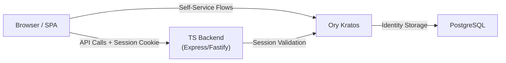
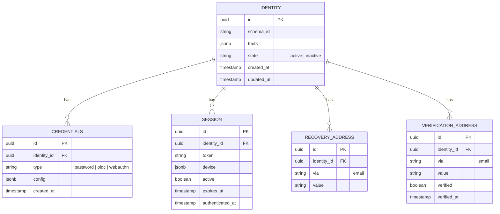
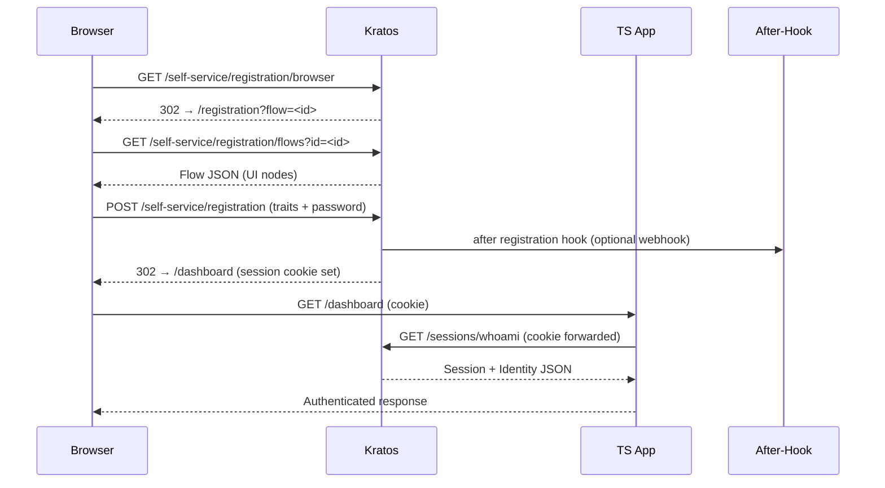
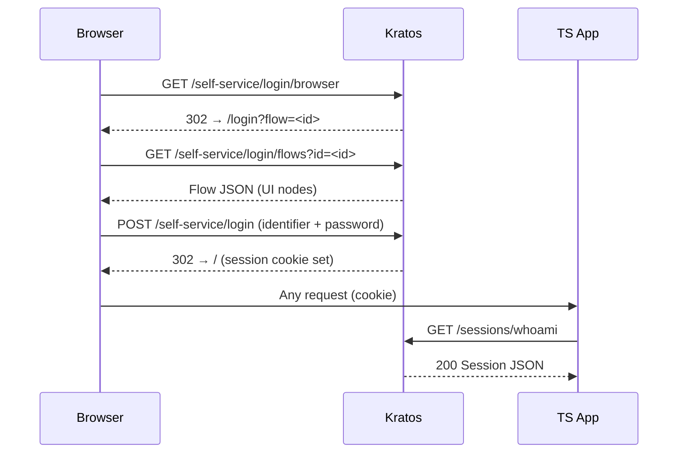
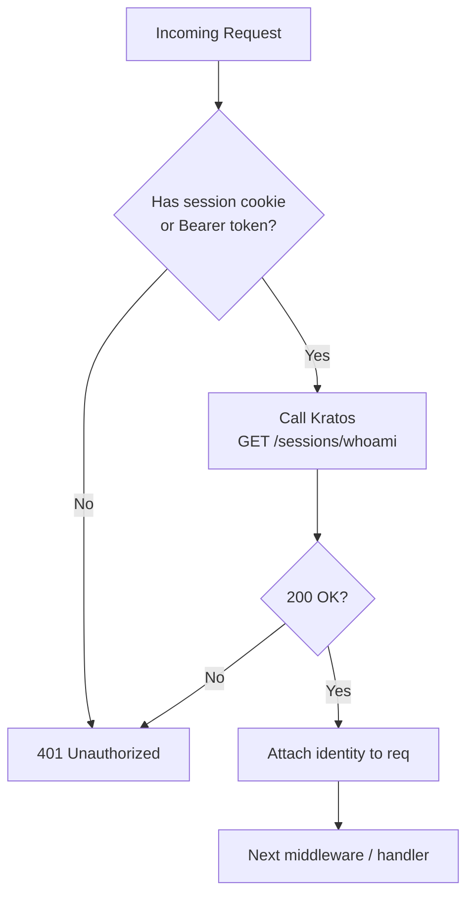

# Integrating Ory Kratos with a TypeScript App

## Architecture Overview



---

## Identity Schema (ERD)

Kratos stores identities using a JSON Schema you define. Here's a typical model:



---

## Self-Service Flows

### Registration Flow



### Login Flow



### Session Validation (Middleware)



---

## TypeScript Implementation

### 1. Install SDK

```bash
npm install @ory/client
```

### 2. Initialize Client

```typescript
import { Configuration, FrontendApi } from "@ory/client";

const kratos = new FrontendApi(
  new Configuration({
    basePath: process.env.KRATOS_PUBLIC_URL, // e.g. http://localhost:4433
  })
);
```

### 3. Session Middleware (Express)

```typescript
import { Request, Response, NextFunction } from "express";
import { Session } from "@ory/client";

declare global {
  namespace Express {
    interface Request {
      session?: Session;
    }
  }
}

export async function requireAuth(
  req: Request,
  res: Response,
  next: NextFunction
) {
  try {
    const { data: session } = await kratos.toSession({
      cookie: req.header("cookie"),
      xSessionToken: req.header("x-session-token"),
    });
    req.session = session;
    next();
  } catch {
    res.status(401).json({ error: "Unauthorized" });
  }
}
```

### 4. Protected Route

```typescript
app.get("/api/me", requireAuth, (req, res) => {
  const { identity } = req.session!;
  res.json({
    id: identity.id,
    email: identity.traits.email,
    name: identity.traits.name,
  });
});
```

### 5. Identity Schema (`identity.schema.json`)

```json
{
  "$id": "https://example.com/identity.schema.json",
  "$schema": "http://json-schema.org/draft-07/schema#",
  "title": "Person",
  "type": "object",
  "properties": {
    "traits": {
      "type": "object",
      "properties": {
        "email": {
          "type": "string",
          "format": "email",
          "title": "Email",
          "ory.sh/kratos": {
            "credentials": { "password": { "identifier": true } },
            "verification": { "via": "email" },
            "recovery": { "via": "email" }
          }
        },
        "name": {
          "type": "object",
          "properties": {
            "first": { "type": "string", "title": "First Name" },
            "last": { "type": "string", "title": "Last Name" }
          }
        }
      },
      "required": ["email"],
      "additionalProperties": false
    }
  }
}
```

---

## Kratos Config Essentials (`kratos.yml`)

```yaml
serve:
  public:
    base_url: http://localhost:4433/
    cors:
      enabled: true
      allowed_origins: ["http://localhost:3000"]
      allowed_methods: ["GET", "POST", "PUT", "DELETE"]
      allow_credentials: true
  admin:
    base_url: http://localhost:4434/

selfservice:
  default_browser_return_url: http://localhost:3000/
  flows:
    registration:
      ui_url: http://localhost:3000/registration
      after:
        password:
          hooks:
            - hook: session
    login:
      ui_url: http://localhost:3000/login
    verification:
      ui_url: http://localhost:3000/verification
      enabled: true
    recovery:
      ui_url: http://localhost:3000/recovery
      enabled: true

identity:
  default_schema_id: default
  schemas:
    - id: default
      url: file:///etc/kratos/identity.schema.json

session:
  lifespan: 24h
  cookie:
    domain: localhost
    same_site: Lax

dsn: postgres://kratos:secret@db:5432/kratos?sslmode=disable
```

---

## Docker Compose (Dev)

```yaml
services:
  kratos:
    image: oryd/kratos:v1.3
    command: serve -c /etc/kratos/kratos.yml --dev --watch-courier
    ports:
      - "4433:4433" # public
      - "4434:4434" # admin
    volumes:
      - ./kratos:/etc/kratos
    depends_on:
      - db

  db:
    image: postgres:16-alpine
    environment:
      POSTGRES_DB: kratos
      POSTGRES_USER: kratos
      POSTGRES_PASSWORD: secret
    ports:
      - "5432:5432"

  kratos-migrate:
    image: oryd/kratos:v1.3
    command: migrate sql -e --yes
    environment:
      DSN: postgres://kratos:secret@db:5432/kratos?sslmode=disable
    depends_on:
      - db
```

---

## Key Gotchas

| Pitfall | Fix |
|---|---|
| CORS errors on cookie flows | Set `allow_credentials: true` + explicit `allowed_origins` (no wildcards) |
| `toSession()` always returns 401 | Forward the full `cookie` header — don't extract individual cookies |
| Flow expired errors | Flows have a default 30min lifespan — restart the flow if expired |
| API vs Browser flows | Use `/browser` endpoints for SPAs with cookies, `/api` for mobile/token-based |
| CSRF issues | Kratos handles CSRF internally via flow tokens — don't add your own on Kratos endpoints |
