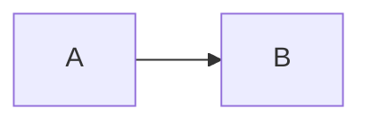

# LLM markdown fixture

This file exercises the constructs covered by issue #72. Open it in the app and
every section below should render as described, in light and dark theme.

## Alerts

> [!NOTE]
> Useful information that users should know, even when skimming.

> [!TIP]
> Helpful advice for doing things better or more easily.

> [!IMPORTANT]
> Key information users need to know to achieve their goal.

> [!WARNING] Urgent info that needs immediate attention, written on one line.

> [!CAUTION]
> Advises about risks or negative outcomes of certain actions.
>
> With a second paragraph and a list:
>
> - one
> - two

## Math

Inline: the sort runs in $O(n \log n)$ time, and \(e^{i\pi} + 1 = 0\).

A price is not math: this costs $5 and that costs $10.

Display, GitHub style:

$$
\int_0^1 x^2 \, dx = \frac{1}{3}
$$

Display, LaTeX style:

\[
\sum_{k=1}^{n} k = \frac{n(n+1)}{2}
\]

## Details

<details>
<summary>Click to expand the implementation notes</summary>

Markdown inside the block renders when it is separated by blank lines:

- a list item
- another one with `code`

```ts
const hidden = true;
```

</details>

## Nested fences

````md
A fenced block inside a fenced block:

```js
console.log("inner");
```
````

~~~text
Tilde fences work too:

```
inner
```
~~~

## Info strings

```ts title="src/app.ts" {2-3}
import { start } from './server';
const port = Number(process.env.PORT ?? 3000);
start(port);
console.log(`listening on ${port}`);
```

```bash filename=setup.sh
pnpm install
pnpm start
```

```diff
- const old = 1;
+ const fresh = 2;
  const same = 3;
```

```jsonc
{
  // comments are fine in jsonc
  "name": "x"
}
```

```env
PORT=3000
SECRET=do-not-commit
```



## File references

The handler lives in `src/renderer.ts:120` and the plugin in `src/plugins/builtin/MathPlugin.ts`.
Compare with `README.md` and `path/does/not/exist.ts:3`. In prose: see examples/water-cycle-and-chemistry.md and
src/index.css:10 for the styles. Not a path: `array.map`, `e.g.`, v1.2.3.

## Footnotes

Claude Code writes plans with footnotes occasionally[^1], and sometimes several[^note].

[^1]: The first footnote, with **bold** text.
[^note]: A named footnote that
    spans two lines.

## Task list

- [ ] unchecked
- [x] checked
