# The Water Cycle & Chemistry of Water 💧

> A visual guide for high school students

---

## What Is Water?

Water is a **molecule** made of 2 hydrogen atoms bonded to 1 oxygen atom — hence **H₂O**.

```mermaid
graph LR
    H1["H<br/>(+)"] ---|covalent bond| O["O<br/>(2−)"]
    H2["H<br/>(+)"] ---|covalent bond| O
    style O fill:#4a90d9,color:#fff
    style H1 fill:#e74c3c,color:#fff
    style H2 fill:#e74c3c,color:#fff
```

The oxygen atom is more **electronegative** — it pulls the shared electrons closer, making water a **polar molecule**. This polarity is the reason water is so special.

---

## Why Polarity Matters

---

## States of Water

Water exists in **three states**, and transitions between them drive the entire water cycle.

| Transition | Energy | What Happens |
|---|---|---|
| Melting | Absorbed | Ice → Liquid |
| Evaporation | Absorbed | Liquid → Vapor |
| Condensation | Released | Vapor → Liquid |
| Freezing | Released | Liquid → Ice |
| Sublimation | Absorbed | Ice → Vapor (skips liquid) |
| Deposition | Released | Vapor → Ice (skips liquid) |

---

## The Water Cycle

```mermaid
graph TD
    Ocean["🌊 Oceans, Lakes & Rivers"]
    Evap["☀️ Evaporation<br/>Sun heats surface water → vapor"]
    Trans["🌿 Transpiration<br/>Plants release vapor through leaves"]
    Rise["⬆️ Rising Water Vapor<br/>Warm air carries moisture upward"]
    Cool["❄️ Condensation<br/>Vapor cools → tiny droplets form clouds"]
    Clouds["☁️ Cloud Formation"]
    Precip["🌧️ Precipitation<br/>Rain, snow, sleet, hail"]
    Runoff["🏔️ Surface Runoff<br/>Water flows downhill into rivers"]
    Infil["⬇️ Infiltration<br/>Water seeps into soil & rock"]
    Ground["🪨 Groundwater Storage<br/>Aquifers & underground reservoirs"]
    Springs["♨️ Springs & Seepage<br/>Groundwater resurfaces"]

    Ocean --> Evap
    Evap --> Rise
    Trans --> Rise
    Rise --> Cool
    Cool --> Clouds
    Clouds --> Precip
    Precip --> Runoff
    Precip --> Infil
    Runoff --> Ocean
    Infil --> Ground
    Ground --> Springs
    Springs --> Ocean
```

---

## The Cycle in Numbers

Only about **0.7%** of all water on Earth is fresh and accessible. That's what the cycle constantly recycles.

---

## Chemical Reactions in the Water Cycle

Water participates in key chemical processes as it moves through the cycle:

```mermaid
flowchart LR
    subgraph Atmosphere
        A1["CO₂ + H₂O → H₂CO₃<br/>(carbonic acid)<br/>Makes rain slightly acidic<br/>pH ≈ 5.6"]
    end

    subgraph Soil & Rock
        B1["H₂CO₃ + CaCO₃ → Ca²⁺ + 2HCO₃⁻<br/>(dissolves limestone)<br/>Creates caves & hard water"]
    end

    subgraph Oceans
        C1["Ca²⁺ + 2HCO₃⁻ → CaCO₃ + CO₂ + H₂O<br/>(coral & shell formation)<br/>Carbon returns to solid form"]
    end

    Atmosphere --> Soil_&_Rock --> Oceans
    Oceans -.->|"CO₂ released<br/>back to air"| Atmosphere
```

This loop connects the **water cycle** to the **carbon cycle** — they're inseparable.

---

## Hydrogen Bonding — The Secret Superpower

```mermaid
graph LR
    subgraph Molecule_1["Water Molecule 1"]
        H1a["H δ+"]
        O1["O δ−"]
        H1b["H δ+"]
        H1a --- O1
        H1b --- O1
    end

    subgraph Molecule_2["Water Molecule 2"]
        H2a["H δ+"]
        O2["O δ−"]
        H2b["H δ+"]
        H2a --- O2
        H2b --- O2
    end

    H1a -.-|"hydrogen bond<br/>(weak, but adds up)"| O2

    style O1 fill:#4a90d9,color:#fff
    style O2 fill:#4a90d9,color:#fff
    style H1a fill:#e74c3c,color:#fff
    style H1b fill:#e74c3c,color:#fff
    style H2a fill:#e74c3c,color:#fff
    style H2b fill:#e74c3c,color:#fff
```

One hydrogen bond is weak. But billions of them together give water its high boiling point, surface tension, and ability to regulate temperature — all critical for life.

---

## Quick Recap

```mermaid
mindmap
  root((Water))
    Chemistry
      H₂O molecule
      Polar covalent bonds
      Hydrogen bonding
      Universal solvent
    States
      Solid — Ice
      Liquid — Water
      Gas — Vapor
    The Cycle
      Evaporation
      Condensation
      Precipitation
      Runoff & Infiltration
    Why It Matters
      Supports all life
      Regulates climate
      Shapes landscapes
      Connects to carbon cycle
```

---

*"Water is the driving force of all nature."* — Leonardo da Vinci
